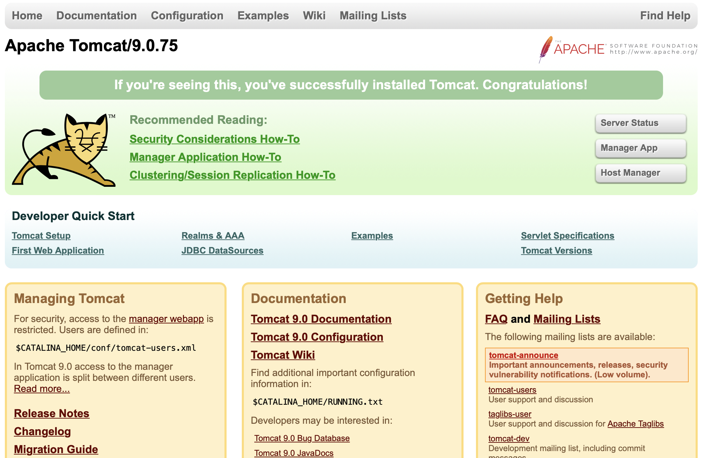

# COMMANDS
- convert `packer-build.json` to `hcl2`

```
packer hcl2_upgrade -with-annotations packer-build.json
chmod +x ./provisioners/scripts/bootstrap.sh

```

- cd into files folder

`wget https://tomcat.apache.org/tomcat-9.0-doc/appdev/sample/sample.war`

- More information

see this [link](https://computingforgeeks.com/build-aws-ec2-machine-images-with-packer-and-ansible/?expand_article=1#google_vignette)

- If deployment is successful, you should see the image below



